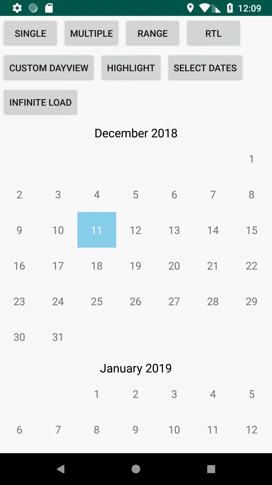
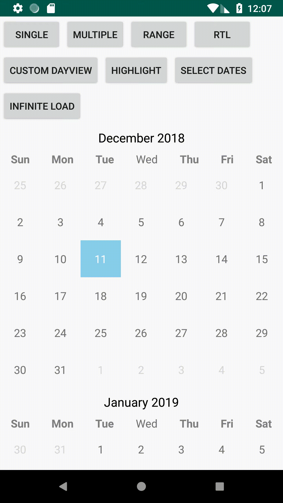

# ShaCalendar

[](https://travis-ci.org/ShahulAndro/sha-calendar-kotlin)

ShaCalendar is new approach of displaying calendar as view or viewgroup in your apps.
It used advanced framework to support and bring your app up-to-date with new versions of Android.
Its easy to integrated and more user-friendly.

ShaCalendar is a lightweight Android library, it's is developed in kotlin

Its not implemented with any third party libraries, its fully implemented on Android apis.
It will save your valueble time. You can easily integrate into your app.

# Features!
  - load the calendar by month and year
  - Single day selection
  - Multiple day selection
  - Select days with range
  - Enable/disable week days in month
  - Custom day view
  - Highlight, select days
  - Infinite calendar loading
  - Right to left lanugage(RTL) support

You can also:
  - Update the views with your custom view with your own data
  - Choose to display previous month days and next month days in the calendar
  - Can able to set and manage custom scroll listener
  - Library supports show or hide weekdays


### Examples
       

#### How to

To get a Git project into your gradle build:

Step 1. Add the JitPack repository to your build file 

Add it in your root build.gradle at the end of repositories:
```
allprojects {
	repositories {
		...
		maven { url 'https://jitpack.io' }
	}
}
```

Step 2. Add the dependency
```
dependencies {
    implementation 'com.github.ShahulAndro:sha-calendar-kotlin:1.0'
}
```

To get a Git project into your maven build:

Step 1. Add the JitPack repository to your build file 

```
<repositories>
    <repository>
	    <id>jitpack.io</id>
		<url>https://jitpack.io</url>
	</repository>
</repositories>
```

Step 2. Add the dependency

```
<dependency>
    <groupId>com.github.ShahulAndro</groupId>
	<artifactId>sha-calendar-kotlin</artifactId>
	<version>Tag</version>
</dependency>
```


```
<com.sha.calendar.kotlin.lib.view.CalendarPickerRecyclerView
        android:id="@+id/calendar_recyclerview"
        android:layout_width="match_parent"
        android:layout_height="wrap_content"/>
```
##### Single Selection:
Single selection mode is the default selection mode, you can set select modes via Calendar Settings like the following code
```
var calendarPickerRecyclerView = findViewById<CalendarPickerRecyclerView>(R.id.calendar_recyclerview)
calendarPickerRecyclerView.layoutManager = LinearLayoutManager(this)
calendarPickerRecylerView.
                initSettings().
                setSelectionMode(SelectionMode.SINGLE).
                apply().
                loadContent()
```
##### Multiple selection:
Multiple selection mode is the default selection mode, you can set select modes via Calendar Settings like the following code
```
calendarPickerRecylerView.initSettings().setSelectionMode(SelectionMode.MULTIPLE).apply().loadContent();
```
##### Range selection:
Range selection mode is the default selection mode, you can set select modes via Calendar Settings like the following code
```
calendarPickerRecylerView.initSettings().setSelectionMode(SelectionMode.RANGE).apply().loadContent();
```
##### Highlight days:
you can highlight the day, group of days and clear the highlight days at runtime, library supports the following methods
```
fun highlightDates(date: Date)
fun highlightDates(dates: Collection<Date>)
fun clearHighlightDate(date: Date)
fun clearHighlightDates(dates: Collection<Date>)
```
###### for example:
&nbsp;
```
calendarPickerRecylerView.highlightDates(Calendar.getInstance().calendarWith(2018, 12, 31).time)
```
you can give any date within the calendar range

##### Select days:
you can select the day, range of days at runtime and clear day selection, library supports the following methods
```
fun selectDate(date: Date)
fun selectDates(from: Date, to: Date)
fun selectDates(from: Calendar, to: Calendar)
fun clearDateSelection(date: Date)
```
###### for example:
&nbsp;
```
val from1 = Calendar.getInstance().calendarWith(2019, 1, 1)
val to1 = Calendar.getInstance().calendarWith(2019, 1, 15)
calendarPickerRecyclerView?.selectDates(from1, to1)

val from2 = Calendar.getInstance().calendarWith(2019, 2, 15)
val to2 = Calendar.getInstance().calendarWith(2019, 2, 28)
calendarPickerRecyclerView?.selectDates(from2, to2)
```
you can give any date range within the calendar


##### RTL(Right-To-Left Language) Support:
- programatically you can switch the rtl support
- you can load rtl with settings->language->select any rtl support language as device language

you can set your calendar setting for rtl support like the following
```
fun setLocale(locale: Locale?): CalendarSettings
fun setForceDisplayRTL(isForceDisplayRTL: Boolean): CalendarSettings
```
###### for example: 
&nbsp;
```
calendarPickerRecyclerView.
                    initSettings().
                    setLocale(Locale("ar")).
                    setForceDisplayRTL(true).
                    setSelectionMode(SelectionMode.RANGE).
                    apply().
                    loadContent()
```

You can test rtl support with setting in your device lanaguage setting like the following


##### Infinite Calendar loading:
You can set Calendar settings to infinite load like the following
```
fun setLoadInfinite(loadInfinite: Boolean): CalendarSettings
```
###### For example:
&nbsp;
```
calendarPickerRecyclerView.
                    initSettings().
                    setLoadInfinite(true).
                    apply().
                    loadContent()
```
##### Show/Hide Weekdays:
Library supports show or hide weekdays with the following Calendar Settings

```
fun setDisplayWeekDaysByMonth(canDisplayWeekDays: Boolean): CalendarSettings
```
###### For example:
&nbsp;
```
calendarPickerRecylerView.
                        initSettings().
                        setDisplayWeekDaysByMonth(true).
                        apply().
                        loadContent();
```

##### Show/Hide next/previous mont days:
Library supports show or hide next/previous month days within calendar month with the following Calendar Settings

```
fun setDisplayPreviousNextMonthDaysByMonth(canDisplayPreviousNextMonthDays: Boolean): CalendarSettings
```
###### For example:
&nbsp;
```
calendarPickerRecylerView.
                        initSettings().
                        setDisplayPreviousNextMonthDaysByMonth(false).
                        apply().
                        loadContent();
```

License
-------

    Copyright 2018 Shahul Hameed Shaik

    Licensed under the Apache License, Version 2.0 (the "License");
    you may not use this file except in compliance with the License.
    You may obtain a copy of the License at

       http://www.apache.org/licenses/LICENSE-2.0

    Unless required by applicable law or agreed to in writing, software
    distributed under the License is distributed on an "AS IS" BASIS,
    WITHOUT WARRANTIES OR CONDITIONS OF ANY KIND, either express or implied.
    See the License for the specific language governing permissions and
    limitations under the License.